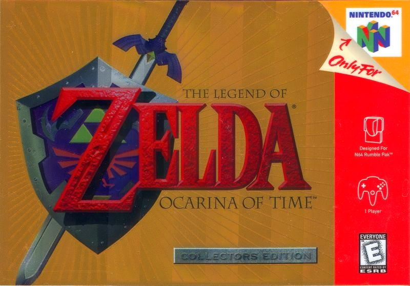

<html>

<body>

<section>

    

        
    

    

        

 

 

 
The Legend of Zelda: Ocarina of Time is an action-adventure game developed and published by Nintendo for the Nintendo 64. It was released in Japan and North America in November 1998, and in PAL regions the following month. Ocarina of Time is the fifth game in The Legend of Zelda series, and the first with 3D graphics.

</section>

</body>
</html>