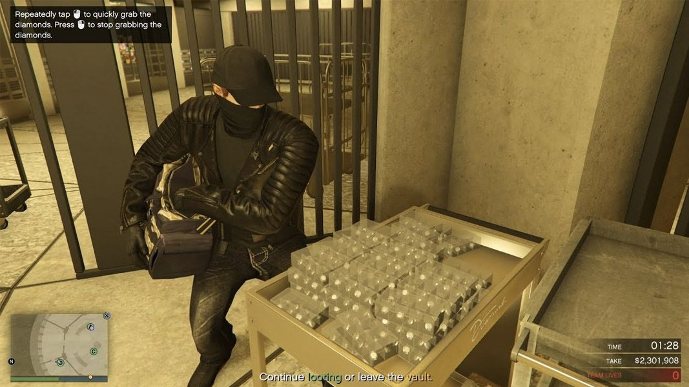
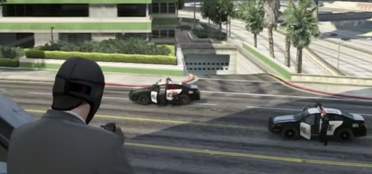
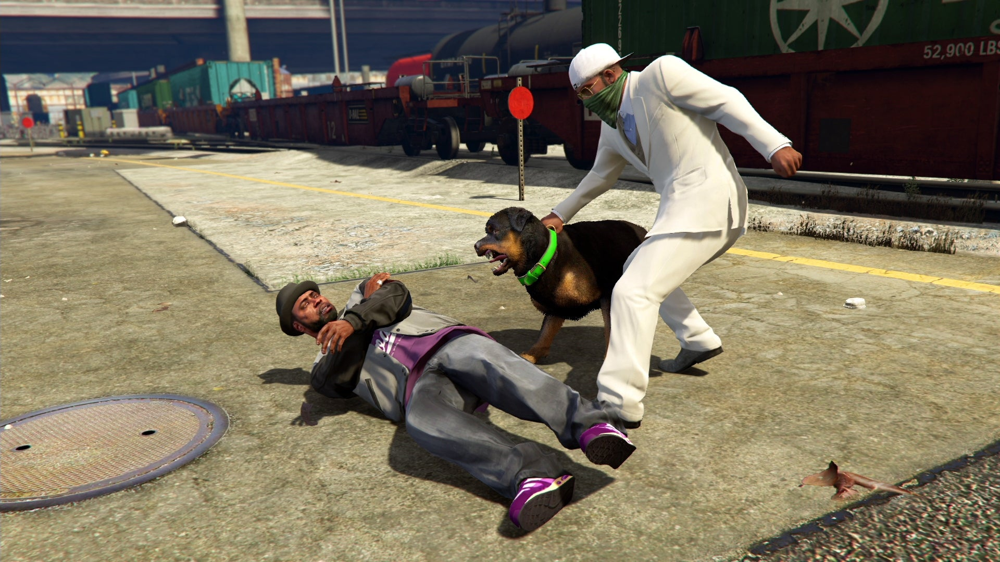
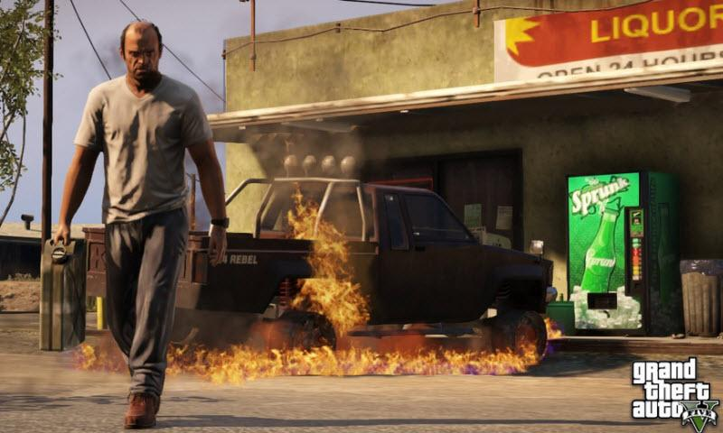

Grand Theft Auto V is an action-adventure game played from either a third-person or first-person perspective. Players complete missions—linear scenarios with set objectives—to progress through the story. Outside of the missions, players may freely roam the open world. Composed of the San Andreas open countryside area, including the fictional Blaine County, and the fictional city of Los Santos, the world is much larger in area than earlier entries in the series. It may be fully explored after the game's beginning without restriction, although story progress unlocks more gameplay content. You can play as trevor, michael, and franklin pictured below.

## GamePlay

<iframe style="height: 450px;" src="https://www.youtube.com/embed/mHaJqQ20400" frameborder="0" allow="accelerometer; autoplay; encrypted-media; gyroscope; picture-in-picture" allowfullscreen></iframe>

What is great about the game is you can use mods to extend the game and to play around with the physics.
For example there is even a Grinch mod

<iframe style="height: 450px;" src="https://www.youtube.com/embed/RlFaUf2YAqs" frameborder="0" allow="accelerometer; autoplay; encrypted-media; gyroscope; picture-in-picture" allowfullscreen></iframe>

## Gallery

## Review

Grand Theft Auto is extremely fun and never gets old. There is loads of missions on story mode and online. The storyline is great and easy to follow. It is an open world so you can go to the gym, tattoo parlor, clothing stores, there is even a strip club and the list goes on. There is not much you cannot do and even messing with the mechanics or adding assets is possible through mods.

