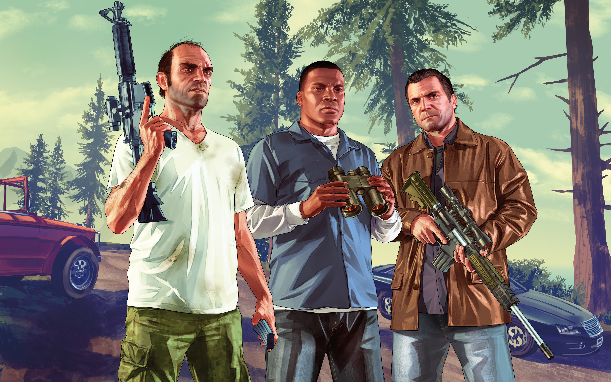

Grand Theft Auto V is an action-adventure game played from either a third-person or first-person perspective. Players complete missions—linear scenarios with set objectives—to progress through the story. Outside of the missions, players may freely roam the open world. Composed of the San Andreas open countryside area, including the fictional Blaine County, and the fictional city of Los Santos, the world is much larger in area than earlier entries in the series. It may be fully explored after the game's beginning without restriction, although story progress unlocks more gameplay content. You can play as trevor, michael, and franklin pictured below.

### GamePlay

What is great about the game is you can use mods to extend the game and to play around with the physics.
For example there is even a Grinch mod

