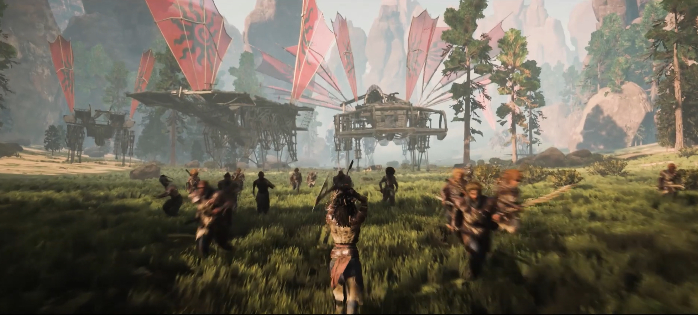
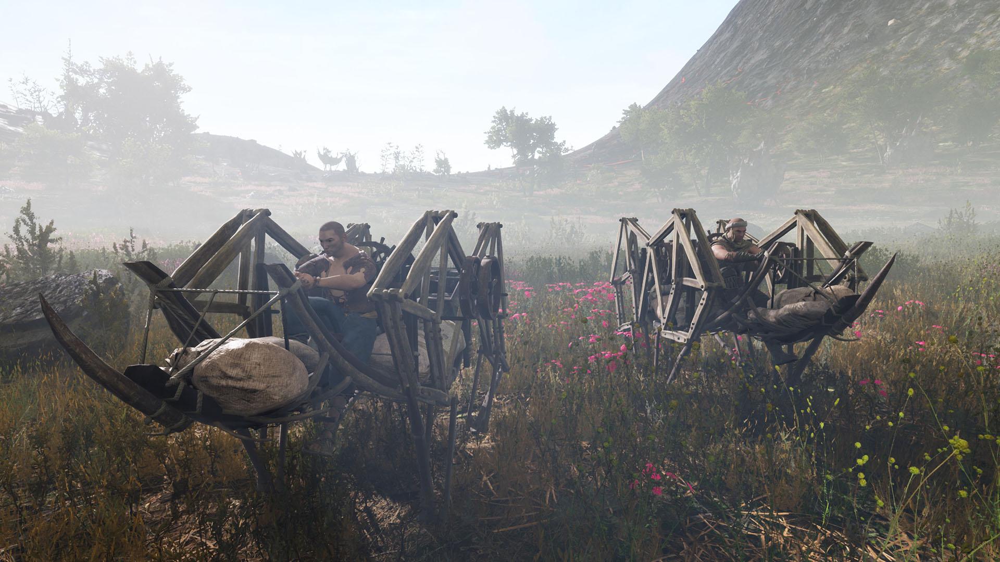
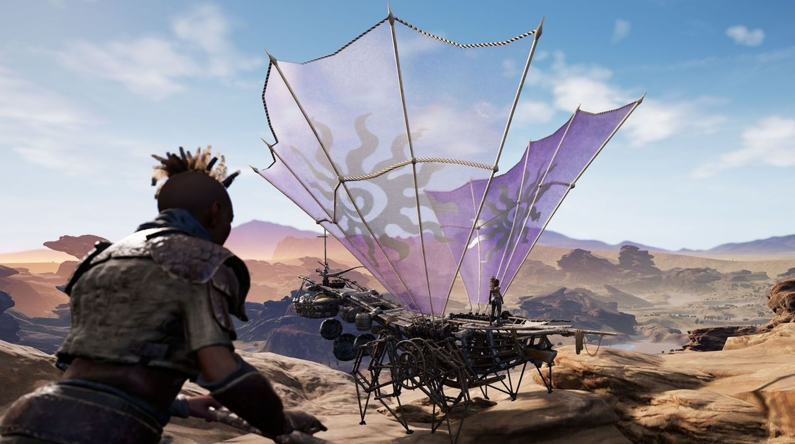
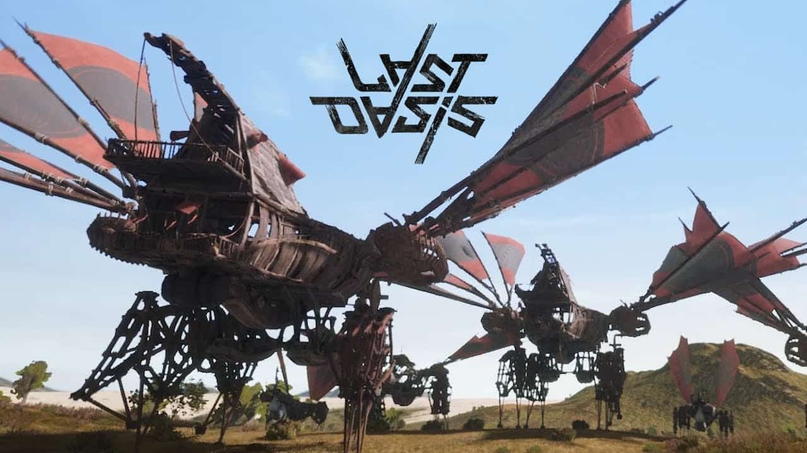
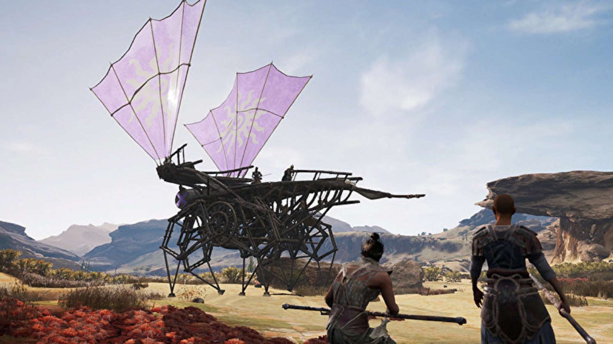

Last Oasis is a Nomadic Survival MMO. Earth has stopped rotating, and the last human survivors need to outrun the scorching Sun in a massive Open World. ... After a cataclysmic event halted the Earth's rotation, the planet was split into two extreme and deadly environments.

Survival is the name of the game, with the harsh environment combined with desperate pirates roaming constantly life itself is a challenge.

This game hosts a wide variety of vehicles/ships called "walkers" that we use to survive and battle with.

